# SQL Murder Mystery Investigation

## Resolución del Caso: SQL Murder Mystery

## Datos del Detective

Nombre: Daniel Mesa Patiño
Investigación con SQL – SQL Murder Mystery

---

# Resumen del Caso

El 15 de enero de 2018 ocurrió un asesinato en **SQL City**.
A partir del reporte policial inicial, se inició una investigación utilizando consultas SQL para examinar diferentes tablas de la base de datos, incluyendo reportes de crimen, registros de personas, entrevistas, membresías de gimnasio y eventos.

Tras analizar cuidadosamente las pistas proporcionadas por los testigos y rastrear los movimientos del sospechoso, se descubrió que el asesinato fue ejecutado por **Jeremy Bowers**. Sin embargo, durante su interrogatorio, Jeremy confesó que había sido contratado para cometer el crimen.

Siguiendo las pistas adicionales proporcionadas en su confesión, se identificó finalmente a **Miranda Priestly** como la autora intelectual del asesinato.

---

# Bitácora de Investigación

A continuación se documenta paso a paso el proceso seguido para resolver el crimen utilizando consultas SQL.

---

# Paso 1 — Buscar el reporte del crimen

```sql
SELECT *
FROM crime_scene_report
WHERE date = 20180115
AND type = 'murder'
AND city = 'SQL City';
```

### Explicación

Primero se buscó el reporte del crimen utilizando la fecha y la ciudad recordadas por el detective.
Esta consulta permitió encontrar la descripción del asesinato y descubrir que existían **dos testigos** que podrían proporcionar información adicional sobre el caso.

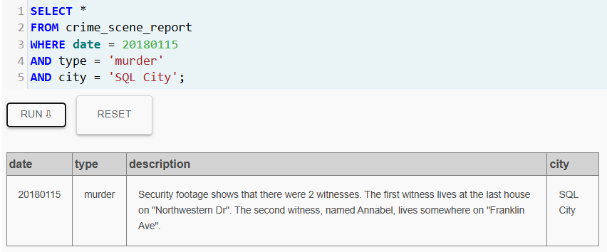

---

# Paso 2 — Identificar al primer testigo

```sql
SELECT *
FROM person
WHERE address_street_name = 'Northwestern Dr'
ORDER BY address_number DESC;
```

### Explicación

El reporte indicaba que el primer testigo vivía en **Northwestern Dr** y era la última casa de la calle.
Al ordenar las direcciones en orden descendente se identificó al testigo **Morty Schapiro**.

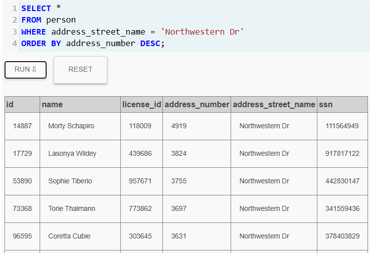

---

# Paso 3 — Revisar la entrevista del primer testigo

```sql
SELECT *
FROM interview
WHERE person_id = 14887;
```

### Explicación

La entrevista de Morty Schapiro reveló una pista importante:
el asesino había estado recientemente en el gimnasio **Get Fit Now** y su número de membresía comenzaba con **48Z**.

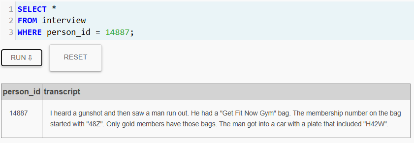

---

# Paso 4 — Buscar miembros del gimnasio con esa membresía

```sql
SELECT *
FROM get_fit_now_member
WHERE id LIKE '48Z%';
```

### Explicación

Con la pista del número de membresía se buscó en la tabla de miembros del gimnasio aquellos cuyo ID comenzara con **48Z**, reduciendo la lista de posibles sospechosos.

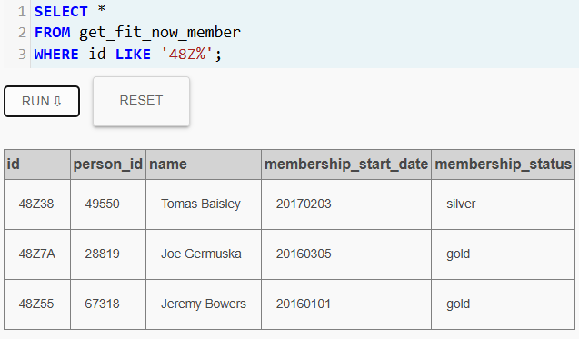

---

# Paso 5 — Revisar registros de entrada al gimnasio

```sql
SELECT *
FROM get_fit_now_check_in
WHERE check_in_date = 20180109;
```

### Explicación

El testigo también mencionó que el sospechoso estuvo en el gimnasio el **9 de enero de 2018**, por lo que se revisaron los registros de entrada de ese día.

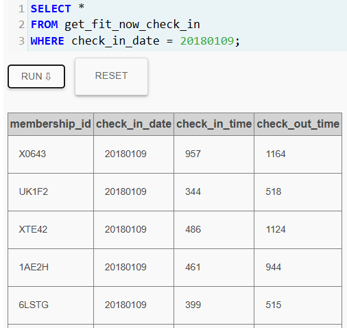

---

# Paso 6 — Identificar al segundo testigo

```sql
SELECT *
FROM person
WHERE name LIKE 'Annabel%'
AND address_street_name = 'Franklin Ave';
```

### Explicación

El reporte policial indicaba que el segundo testigo se llamaba **Annabel** y vivía en **Franklin Avenue**.
Esta consulta permitió identificar a **Annabel Miller**.

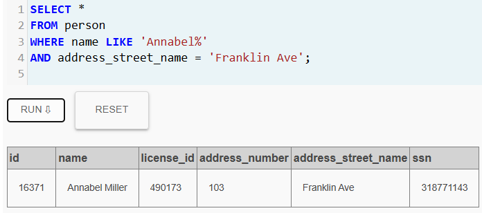

---

# Paso 7 — Leer la entrevista de Annabel

```sql
SELECT *
FROM interview
WHERE person_id = 16371;
```

### Explicación

En su entrevista, Annabel Miller explicó que reconoció al asesino porque lo había visto anteriormente en el gimnasio.

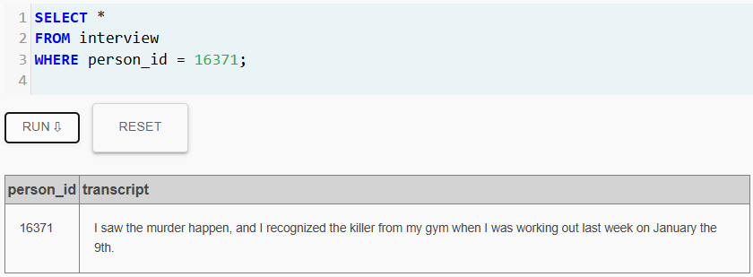

---

# Paso 8 — Identificar al sospechoso

```sql
SELECT *
FROM person
WHERE name = 'Jeremy Bowers';
```

### Explicación

Con las pistas obtenidas durante la investigación se logró identificar al sospechoso **Jeremy Bowers**, quien coincidía con la información recopilada.

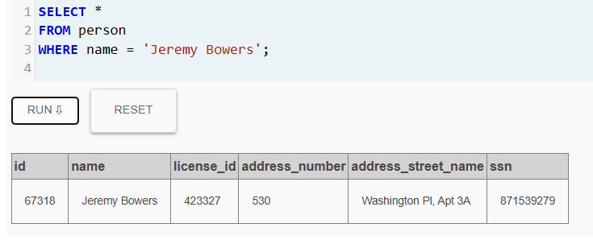

---

# Paso 9 — Analizar la confesión

```sql
SELECT *
FROM interview
WHERE person_id = 67318;
```

### Explicación

En su interrogatorio, Jeremy Bowers confesó haber cometido el asesinato.
Sin embargo, reveló que lo hizo porque fue contratado por otra persona.

Proporcionó las siguientes pistas sobre quien lo contrató:

* mujer
* cabello rojo
* conduce un Tesla Model S
* asistió tres veces al evento **SQL Symphony Concert** en diciembre de 2017

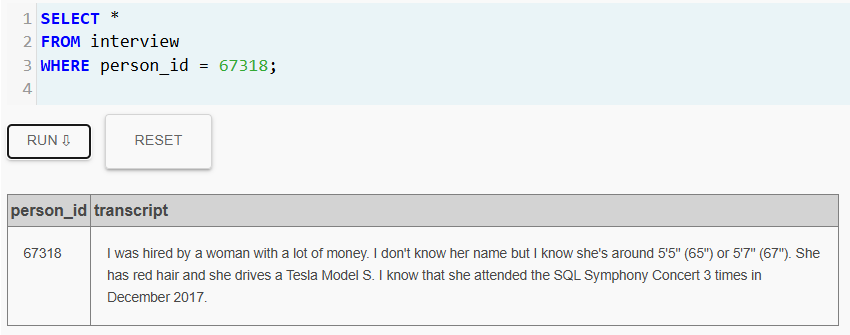

---

# Paso 10 — Buscar personas que coincidan con la descripción

```sql
SELECT *
FROM drivers_license
WHERE hair_color = 'red'
AND car_make = 'Tesla'
AND car_model = 'Model S';
```

### Explicación

Se utilizaron las características descritas por Jeremy para buscar posibles sospechosos en la tabla de licencias de conducir.

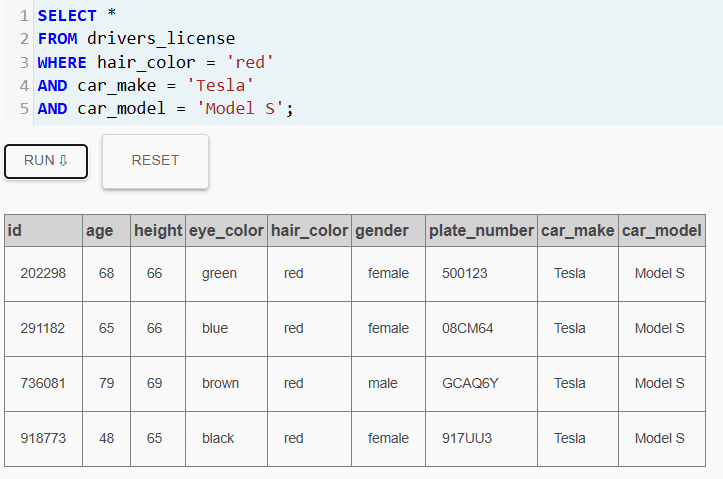

---

# Paso 11 — Verificar asistencia al concierto

```sql
SELECT person_id, COUNT(*)
FROM facebook_event_checkin
WHERE event_name = 'SQL Symphony Concert'
AND date LIKE '201712%'
GROUP BY person_id
HAVING COUNT(*) = 3;
```

### Explicación

Jeremy mencionó que la persona que lo contrató asistió **tres veces al concierto SQL Symphony Concert en diciembre de 2017**, por lo que se filtraron los registros del evento para encontrar quién cumplía con ese patrón.

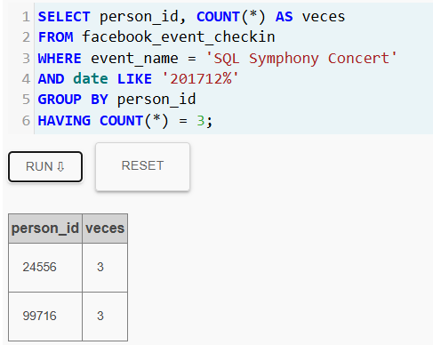

---

# Paso 12 — Identificar a la autora intelectual

```sql
SELECT *
FROM person
WHERE id = 99716;
```

### Explicación

La consulta reveló que la persona que coincide con todas las pistas es **Miranda Priestly**, quien fue identificada como la autora intelectual del asesinato.

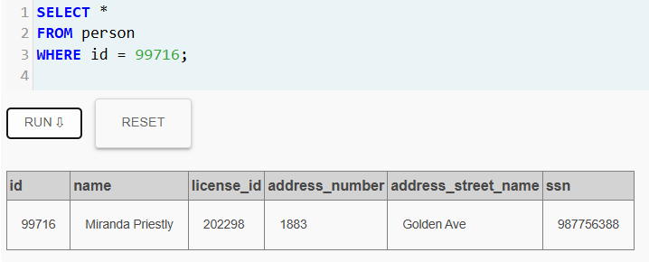

---

# Paso 13 — Registrar la solución final

```sql
INSERT INTO solution VALUES (1, 'Miranda Priestly');

SELECT value FROM solution;
```

### Explicación

Finalmente se registró la solución en la base de datos del juego, confirmando que la investigación fue resuelta correctamente.

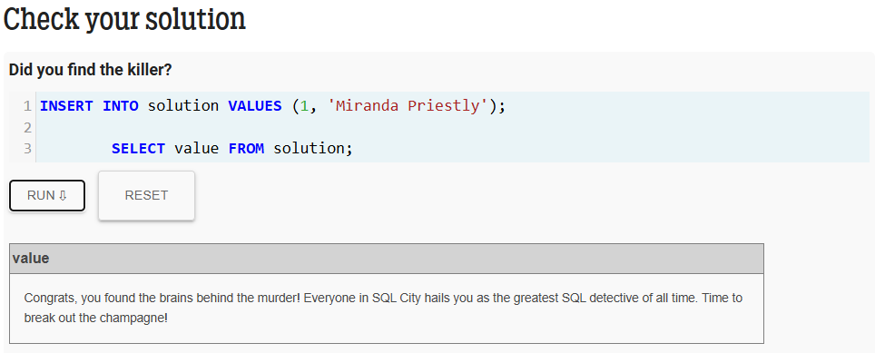

---

# Conclusión Final de la Investigación

Después de analizar las pistas y consultar múltiples tablas de la base de datos:

* **Autor material del asesinato:** Jeremy Bowers
* **Autora intelectual del crimen:** Miranda Priestly

La investigación fue resuelta utilizando consultas SQL para rastrear evidencias, analizar testimonios y relacionar diferentes fuentes de información dentro de la base de datos.
